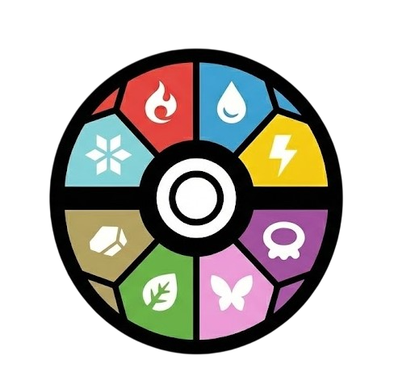

# PokeHelper Tool

<div align="center">
  
  <p><strong>Herramienta de análisis de equipos Pokémon (Gen 9)</strong></p>
</div>

## Descripción

PokeHelper Tool es una aplicación web avanzada para el análisis competitivo de equipos Pokémon. Diseñada para jugadores que buscan optimizar sus equipos, la herramienta integra información detallada de cada Pokémon junto con análisis de coberturas ofensivas y defensivas, cálculo de matchups y escaneo de encuentros salvajes.

Toda la información está actualizada a la **Novena Generación** y utiliza traducciones oficiales en español de los archivos del juego a través de PokeAPI.

## Funcionalidades

### Gestión de Equipo

Configura tu equipo de hasta 6 Pokémon con información completa:

- **Búsqueda de Pokémon**: Autocompletado con más de 1000 Pokémon de todas las generaciones, mostrando sprites oficiales.
- **Movimientos**: Selección de hasta 4 movimientos por Pokémon con indicadores visuales de tipo, categoría de daño (físico/especial) y descripciones detalladas en tooltips.
- **Habilidad**: Búsqueda de habilidades con descripciones completas de sus efectos.
- **Naturaleza**: Selector de naturalezas con indicadores visuales de las estadísticas modificadas (incremento/decremento del 10%).
- **Objeto equipado**: Búsqueda de objetos equipables con sprites oficiales y descripciones de efectos.
- **Estadísticas destacadas**: Visualización automática de las 2-3 estadísticas base más altas de cada Pokémon con abreviaturas en español (PS, Atq, Def, AtE, DeE, Vel).
- **Importación Pokepaste**: Importa equipos completos directamente desde el formato Pokepaste de Pokémon Showdown, extrayendo automáticamente Pokémon, movimientos, habilidades, naturalezas y objetos.

### Análisis Defensivo

Visualiza el impacto defensivo de todos los tipos sobre tu equipo:

- Tabla con los 18 tipos atacantes y cómo afectan a cada miembro del equipo.
- Cálculo preciso de multiplicadores considerando tipos duales (x4, x2, x1, x0.5, x0.25, x0).
- Identificación inmediata de debilidades compartidas y resistencias del equipo.
- Resumen de debilidades críticas (x4) y severas (x2) por tipo.

### Cobertura Ofensiva

Analiza la efectividad de los movimientos de tu equipo contra todos los tipos:

- Evaluación de la eficacia de tus movimientos contra cada uno de los 18 tipos defensivos.
- Detección automática de STAB (Same Type Attack Bonus) aplicando el multiplicador x1.5.
- Identificación del mejor multiplicador de daño disponible en el moveset del equipo.
- Detección de tipos sin cobertura efectiva o gaps ofensivos.

### Analizador de Matchups

Compara tu equipo contra equipos rivales:

- Importación de equipos enemigos mediante Pokepaste.
- Matriz de enfrentamientos mostrando ventajas/desventajas tipo por tipo.
- Indicadores de STAB en movimientos ofensivos del rival.
- Visualización clara de matchups favorables, neutros y desfavorables.

### Escáner de Encuentros Salvajes

Analiza encuentros con Pokémon salvajes:

- Análisis de estadísticas base del Pokémon salvaje para ver si es buena idea capturarlo o no.
- Aviso de tipos que cubre el nuevo Pokémon.
- Información de evoluciones y formas, así como los niveles y métodos para conseguirlas.

## Cómo Usar

### Construcción Manual

1. Haz clic en "Pokémon" y busca el Pokémon deseado en el autocompletado.
2. Selecciona hasta 4 movimientos usando el buscador de cada slot.
3. Opcionalmente, añade habilidad, naturaleza y objeto equipado.
4. Repite para cada miembro del equipo (hasta 6 Pokémon).
5. Los datos se guardan automáticamente en el navegador.

### Importación desde Pokepaste

1. Copia tu equipo desde Pokémon Showdown (formato Pokepaste).
2. Haz clic en "Importar Pokepaste" en la aplicación.
3. Pega el contenido en el cuadro de texto.
4. Haz clic en "Importar" y el equipo se cargará automáticamente con:
   - Pokémon y tipos
   - Movimientos
   - Habilidad
   - Naturaleza
   - Objeto equipado

Ejemplo de formato Pokepaste:
```
Garchomp @ Life Orb
Ability: Rough Skin
- Earthquake
- Dragon Claw
- Stone Edge
- Swords Dance

Toxapex @ Black Sludge
Ability: Regenerator
Adamant Nature
- Scald
- Toxic
- Recover
- Haze
```

### Análisis de Matchups

1. Construye o importa tu equipo principal.
2. Ve a la sección "Analizador de Matchups".
3. Haz clic en "Importar Equipo Rival".
4. Pega el Pokepaste del equipo rival.
5. La matriz de matchups se generará automáticamente.

### Escaneo de Encuentros

1. Ve a la sección "Escáner de Encuentros Salvajes".
2. Busca el Pokémon salvaje que encontraste.
3. Si tiene doble tipo, selecciona el segundo tipo.
4. Visualiza qué movimientos son efectivos y qué Pokémon de tu equipo tienen ventaja.

## Características Técnicas

- **Persistencia de Datos**: Los equipos se guardan automáticamente en localStorage.
- **Caché de API**: Sistema de caché inteligente para minimizar llamadas a PokeAPI y mejorar el rendimiento.
- **Traducciones Oficiales**: Todas las descripciones y nombres están en español, obtenidos de los archivos oficiales del juego.
- **Tooltips Informativos**: Descripciones detalladas de efectos de habilidades, objetos y movimientos al pasar el cursor.
- **Diseño Responsivo**: Interfaz adaptada para escritorio y dispositivos móviles.
- **Datos Actualizados**: Información completa hasta la Generación 9 (Scarlet/Violet).

## Iconografía de Tipos
La aplicación utiliza la iconografía original para los tipos Pokémon:

<div align="center">
  <table>
    <tr>
      <td> <br/> Normal</td>
      <td> <br/> Fire</td>
      <td> <br/> Water</td>
      <td> <br/> Grass</td>
      <td> <br/> Electric</td>
      <td> <br/> Ice</td>
    </tr>
    <tr>
      <td> <br/> Fighting</td>
      <td> <br/> Poison</td>
      <td> <br/> Ground</td>
      <td> <br/> Flying</td>
      <td> <br/> Psychic</td>
      <td> <br/> Bug</td>
    </tr>
    <tr>
      <td> <br/> Rock</td>
      <td> <br/> Ghost</td>
      <td> <br/> Dragon</td>
      <td> <br/> Dark</td>
      <td> <br/> Steel</td>
      <td> <br/> Fairy</td>
    </tr>
  </table>
</div>
